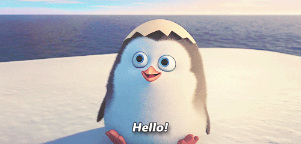

#Hungry Penguin

###Bit Baloon URL: [BitBalloon](http://hungrypenguin.bitballoon.com)

###I. Description: 

Larry the Penguin is hungry! Use your arrow keys to help him eat as many fish as he can before time runs out. Beware the black holes! 

###II. Technologies Used:

* Javascript
* JQuery
* Bootstrap
* Google Fonts
* CSS
* HTML

####III. Unsolved Problems:

* Larry has the tendency to run off the ice, help him stay within bounds.
* Stop the fish and black holes from popping up where the penguin stands.
* Stop the play button from adding more grids.
* Stop the restart button from adding more grids and get it to actually restart the game.
* CSS challenge -- help center the div elements and make the page responsive.  

####V. Credits 

* WDI 26 Instructors & DiR
* WDI 26 for the support and encouragement!
* WDI TAs

###VI. Sources

* MDN
* JQuery UI
* Trello
* iconarchive.com
